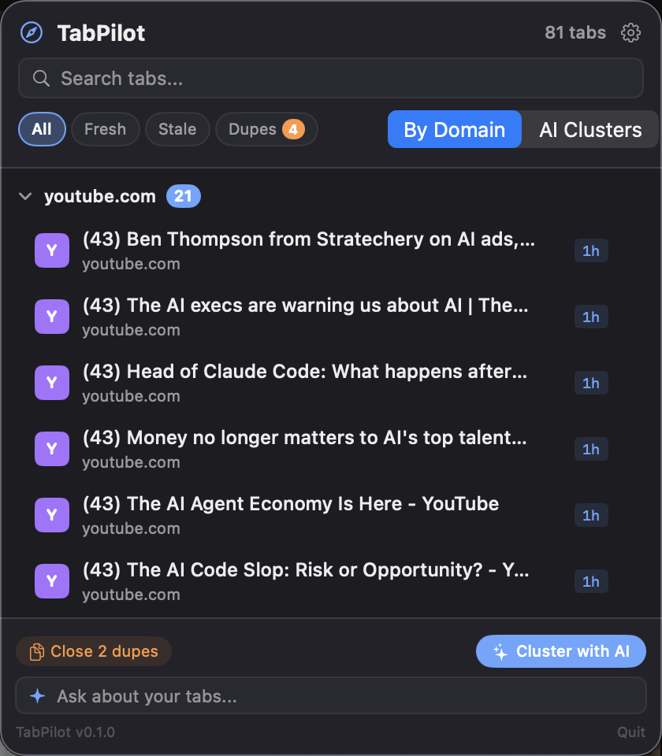
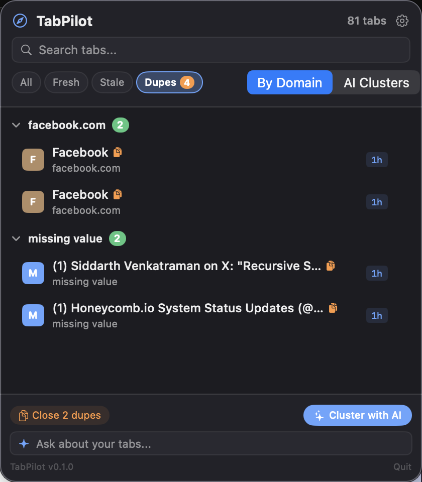
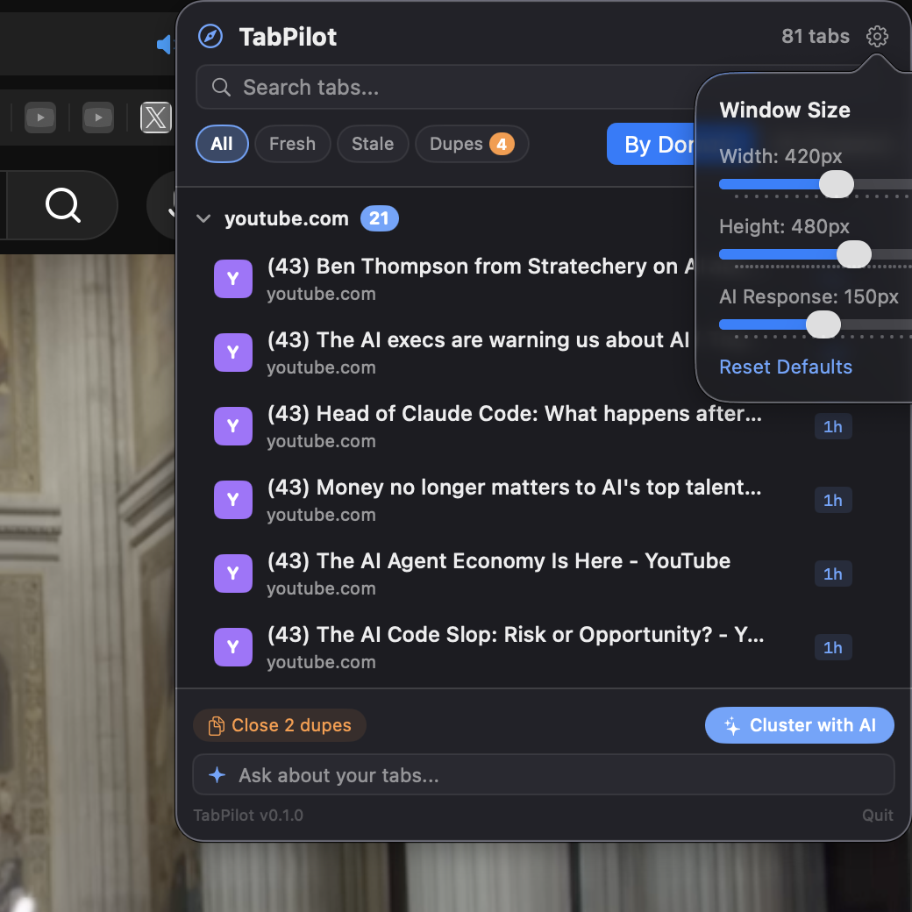

# TabPilot

**AI-powered Safari tab command center for your menu bar.**

See all your tabs organized by domain or AI-detected topics, track tab age, find duplicates, and manage tab overload — without leaving the menu bar.



## The Problem

You have 60+ Safari tabs open. Finding the right one means scanning window after window or trying to remember where something was. Safari offers no concept of "when did I open this?" or "which of these are duplicates?" and no way to semantically group tabs by topic.

TabPilot makes your tab collection instantly comprehensible.

## Features

### Tab Census (always-on)

- Live tab count in the menu bar, updated every 5 seconds
- All tabs from all Safari windows in one scrollable popup
- Grouped by domain, sorted by count (largest domains first)
- Domain initial icons with consistent hash-based colors
- Click any tab to instantly switch to it in Safari
- Close individual tabs with confirmation (hover to reveal X)
- Search/filter by title or URL in real-time


### Staleness & Duplicates

- Age tracking persists across app restarts (`~/.tabpilot/tab_history.json`)
- Color-coded age badges: **fresh** (< 1 hour), **warm** (today), **cooling** (this week), **stale** (7+ days)
- Filter chips: All / Fresh / Stale / Duplicates
- Exact URL duplicate detection with orange badge count
- Bulk "Close N dupes" — keeps one of each URL, closes extras
- Bulk "Close N stale" — closes tabs older than 7 days
- Confirmation dialog before any bulk close operation



### AI Clustering (requires Codex)

- "Cluster with AI" sends tab URLs + titles to a Codex app server
- AI groups tabs into 3-8 semantic clusters (e.g., "React Development", "Apartment Search", "Work Docs")
- Toggle between **By Domain** and **AI Clusters** views
- Re-cluster on demand when your tab set changes

### Natural Language Queries (requires Codex)

- "Ask about your tabs..." input at the bottom of the popup
- Ask things like "find my Rust articles" or "which tabs are about machine learning?"
- Streaming markdown responses from Codex
- Dismiss responses with the X button when done

### Customizable Layout

- Settings gear with sliders for window width, height, and AI response area
- All settings persist across app restarts via `@AppStorage`



## Install

### Homebrew (recommended)

```bash
brew tap scasella/tap
brew install --cask tabpilot
open /Applications/TabPilot.app
```

The app is signed with Developer ID and notarized by Apple — no Gatekeeper warnings.

### Build from source

```bash
git clone https://github.com/scasella/TabPilot.git
cd TabPilot
chmod +x build.sh
./build.sh
open TabPilot.app
```

### Manual compile

```bash
swiftc -parse-as-library -o TabPilot TabPilot.swift
./TabPilot
```

### Requirements

- macOS 14+ (Sonoma or later)
- Safari running with at least one tab open
- Xcode Command Line Tools (for `swiftc`)

### First launch setup

1. **Grant automation permission** — macOS will prompt you to allow TabPilot to control Safari. Accept the dialog, or enable it manually in System Settings > Privacy & Security > Automation > TabPilot > Safari.
2. **For AI features** (optional) — Start a Codex app server:
   ```bash
   codex app-server --listen ws://127.0.0.1:8080
   ```
   Domain grouping, search, staleness, and duplicates all work without Codex.

## Usage

| Action | How |
|--------|-----|
| See all tabs | Click the tab count in the menu bar |
| Find a tab | Type in the search bar — filters by title and URL |
| Switch to a tab | Click any tab row |
| Close a tab | Hover over a tab, click the X, confirm |
| Show only stale tabs | Click the "Stale" filter chip |
| Show only duplicates | Click the "Dupes" filter chip |
| Bulk close duplicates | With Dupes filter active, click "Close N dupes" |
| Bulk close stale tabs | With Stale filter active, click "Close N stale" |
| AI clustering | Click "Cluster with AI" (requires Codex server) |
| Ask about tabs | Type a question in "Ask about your tabs..." |
| Resize the window | Click the gear icon, adjust sliders |
| Quit | Click "Quit" at the bottom-right |

## Architecture

Single file: `TabPilot.swift` (1644 lines). No dependencies. No Xcode project. Just `swiftc`.

| Component | Lines | Purpose |
|-----------|-------|---------|
| `TPTheme` | 25 | Dark theme color palette |
| `RawWebSocket` | 170 | TCP-based WebSocket client (bypasses macOS permessage-deflate issue) |
| `SafariTab` | 50 | Tab model — URL, title, age, domain, window/tab index |
| `TabCluster` | 20 | AI cluster model — name, description, tab indices |
| `TabHistoryStore` | 40 | JSON persistence for first-seen/last-seen timestamps |
| `SafariScanner` | 180 | AppleScript-based tab polling, switch-to-tab, close-tab actions |
| `TabClusterer` | 270 | Codex WebSocket integration — JSON-RPC, clustering, NL queries |
| `ContentView` | 770 | Full popup UI — header, search, filters, tab list, footer |
| `TabPilotApp` | 25 | MenuBarExtra entry point with tab count label |

### Performance

| Operation | Time |
|-----------|------|
| Bulk read 80 tab URLs + titles | ~85ms |
| Full scan cycle (AppleScript + processing) | ~100ms |
| Poll interval | 5 seconds |
| Tab history JSON write | ~1ms |

### Data storage

Tab history is stored at `~/.tabpilot/tab_history.json`:

```json
{
  "firstSeen": { "https://example.com": "2026-02-25T10:30:00Z" },
  "lastSeen": { "https://example.com": "2026-02-25T14:00:00Z" }
}
```

Settings (window dimensions) are stored in macOS UserDefaults.

## Troubleshooting

| Problem | Solution |
|---------|----------|
| "Automation permission denied" | System Settings > Privacy & Security > Automation > enable TabPilot > Safari |
| No tabs showing | Make sure Safari is running with at least one window and tab open |
| Tab count shows 0 | Wait 5 seconds for the first poll cycle, or relaunch |
| "Cannot connect to Codex" | AI features require a running Codex server. All other features work without it. |
| Close popover disappears | This was fixed — the close button now stays anchored even when the cursor moves |
| Window doesn't resize | Adjust sliders in the settings gear; changes apply immediately |

## How it works

1. **Polling**: Every 5 seconds, TabPilot runs a single AppleScript that bulk-reads all tab URLs and titles from all Safari windows. This takes ~85ms for 80 tabs.

2. **Age tracking**: Each unique URL gets a `firstSeen` timestamp on first encounter. These persist to disk, so tab age accumulates across app restarts.

3. **Domain grouping**: URLs are parsed to extract domains, then tabs are grouped and sorted by group size.

4. **Duplicate detection**: Tabs with identical URLs are flagged. The count appears on the "Dupes" filter chip.

5. **AI clustering** (optional): Tab URLs + titles are sent to a Codex app server via raw TCP WebSocket (JSON-RPC protocol). The AI returns semantic cluster assignments as structured JSON.

6. **NL queries** (optional): Free-form questions are sent to Codex with the full tab list as context. Responses stream back with markdown formatting.

## Tech stack

- **Swift + SwiftUI** — single-file, no dependencies
- **MenuBarExtra** with `.window` style for rich popup
- **NSAppleScript** for Safari tab reading and control
- **NWConnection** (Network.framework) for raw TCP WebSocket to Codex
- **@AppStorage** for persistent user preferences
- **JSON-RPC 2.0** for Codex protocol communication
- Compiles with `swiftc -parse-as-library` — no Xcode required

## License

MIT
